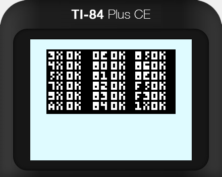

# CHIP-8 Emulator for the TI-84 CE

This repository contians the source code for a CHIP-8 emulator that runs on the venerable TI-84, specifically the TI-84 CE. It is an exercise in embedded software development.

## Custom ROMs

You can convert your CHIP-8 ROMs into a format readable by CHIP84CE by using my online [ROM converter](https://leong.sh/chip84ceromcreator/). All conversion is done client-side, and nothing is sent to a server. The [source code](https://github.com/kyleleong/chip84ceromcreator/) for this converter is also available.

## Tools

I used the [CE Programming](https://github.com/CE-Programming/toolchain) toolchain as the C compiler for this project, and the [Cemu Emulator](https://github.com/CE-Programming/CEmu) for testing and debugging.

## Build Instructions

Follow the toolchain setup instructions, and then run `make` or `make debug` in the project's directory.
